# Aleksandra Yehhi

Минск, UTC+3.

Системный администратор Linux в компании ~100 человек: Windows AD, ZStack, Linux, печать, учётки, внутренние Telegram-боты. Параллельно студия YEHHI: сайты с формой заявки, боты, автоматизация на Python / Docker / systemd.

Только частичная занятость или проект, до 60 часов в месяц. Полный день не рассматриваю.

- Сайт: https://yehhialeksandra.github.io/portfolio/
- Хабр: https://habr.com/ru/users/YehhiStudio/
- Почта: yehhialeksandra@gmail.com

---

Minsk, UTC+3. Linux sysadmin for a ~100-person company (Windows AD, ZStack, Linux, print, accounts, internal Telegram bots). In parallel, YEHHI: sites with a lead form, bots, automation on Python / Docker / systemd.

Part-time or project only, up to 60 hours a month. Not full-time.

---

